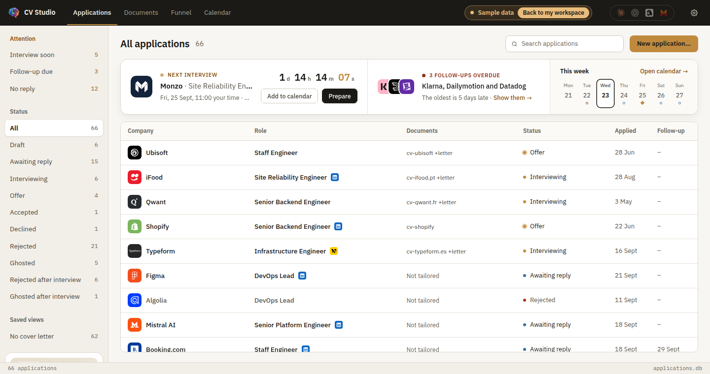
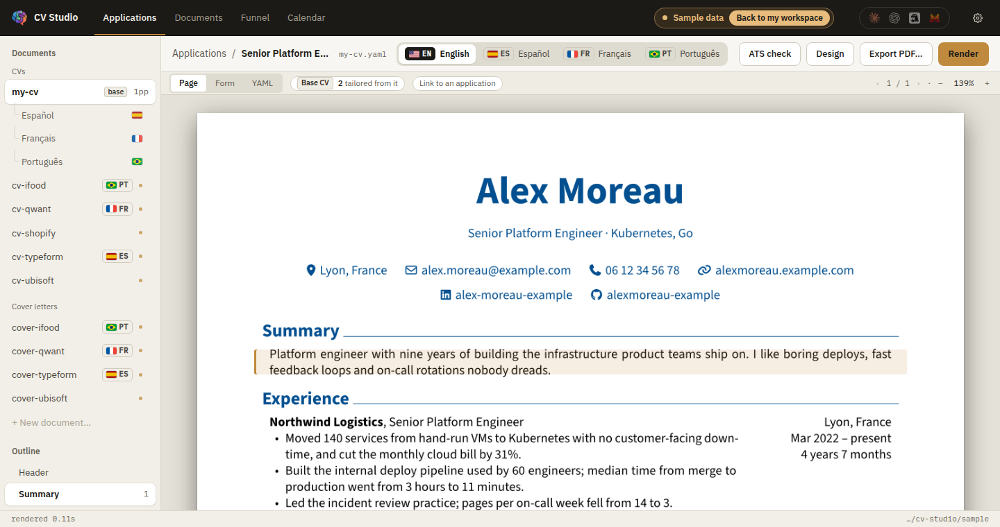
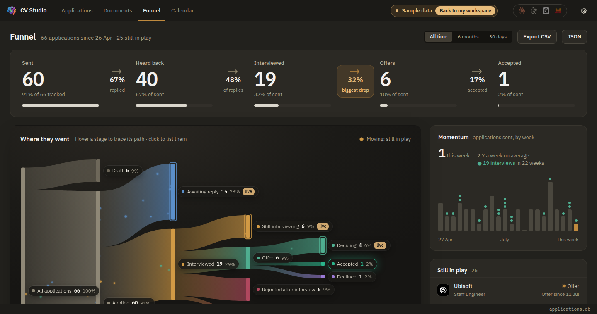
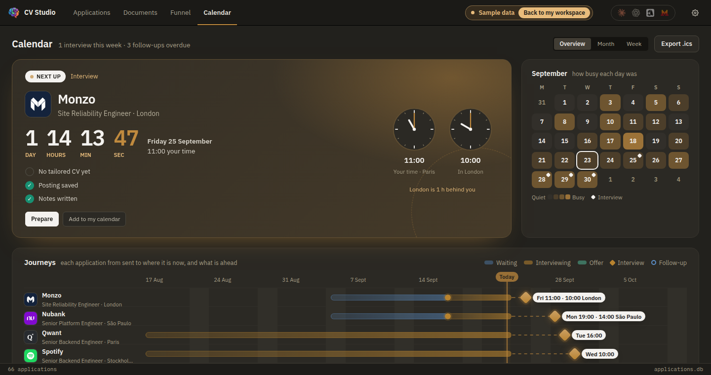

# CV Studio

The eyes of a CV written by an AI.

Claude or ChatGPT reads the posting and writes the YAML, through an MCP server
that ships inside this app. Point it at your mail as well and it keeps the
application tracker in step with your inbox, without this app ever touching a
Google account. CV Studio renders it, shows you the page and what it
costs in space, and lets you fix by hand what is quicker pointed at than
described: click a block on the page and you are editing it. When the model
changes a file you have open, the app notices and offers you its version.

It works perfectly well on its own, too: a local CV editor with live PDF
preview, built on [RenderCV](https://github.com/rendercv/rendercv) and
[Typst](https://typst.app).

Everything runs on your machine, with no account, no server, no telemetry,
which matters more once a model is editing the files, not less. Your CVs are
plain YAML in a folder you own, with no database between you and them, so you
can read, grep, diff, back up and version them without this app, and take them
somewhere else whenever you like. Applications are rows in `applications.db`
beside them, which exports to JSON or CSV for the same reason. Both halves only
ever touch that folder.

Connecting a client is one button in **Settings → AI clients**: Claude Desktop;
OpenAI, where the same config file covers the ChatGPT app, the Codex CLI and the
Codex IDE extension; Hermes Agent, where one config covers Hermes Desktop, the
TUI and the CLI; or Mistral Vibe. See [MCP.md](MCP.md) for what the model can
and cannot do.

## Install

Download the installer for your platform from Releases.

Windows installs per-user, so there is no admin prompt.

Neither build is signed by its platform vendor, so the first launch needs one
extra step:

- **macOS**: drag CV Studio to Applications, then run this once:

  ```bash
  xattr -dr com.apple.quarantine "/Applications/CV Studio.app"
  ```

  It opens normally after that. Until you do, macOS says the app is **damaged
  and can't be opened**, which is what it reports for anything downloaded that
  Apple has not notarized. The app is not damaged and the command disables
  nothing system-wide: it clears the flag macOS put on that one download.
  Right-click → **Open** was the old way around this and macOS 15 removed it.
- **Windows**: SmartScreen may show "Windows protected your PC". Choose
  **More info → Run anyway**.

Nothing else is required. Python, RenderCV, Typst and the fonts are all bundled.

## Using it

On first launch it creates a workspace at `~/Documents/CV Studio` with a starter
CV, and walks you through a short setup: import a CV you already have (a PDF or
your LinkedIn export) or start blank, your name and contact details at the top,
the theme it prints in, shown on your own rendered page as you choose, and an AI
client to connect. Each step can be skipped, and **Settings → Workspace → Run
setup again** brings it back. Under *Skip setup*, **Try it with sample data**
opens the app on a made-up search of sixty-odd applications, with CVs, letters
and translations, in a folder of its own: your workspace is never touched, and
*Back to my workspace* in the title bar returns you to it.



There are four tabs across the top.

**Applications** is home, and it is `applications.db`. The list takes the
middle: company and logo, role, where it was found, the documents written for
it, status, when it was sent and when to follow up. Down the left, *Attention*
gathers what needs you (an interview soon, a follow-up due, no reply for a
fortnight), with the statuses and saved views under it. Above the list,
**Next up** says what is coming: the next interview with a live countdown, in
your time and theirs; the follow-ups that are late, with *Show them*; and this
week in seven days. It is only there when something is, and when an interview is
under three hours away it takes the whole strip, with what is ready for it.

Click a row and the application opens beside the list, and `↑` `↓` walk through
them without closing it. Its facts sit in one card: status, follow-up date, how
good a fit it is, where you found it, the language the posting is in, and the
interview, with the zone the invitation gave it in. Under them, the CV and cover
letter written for it, as pages; opposite, your notes and **the posting**, saved
as text with its headings and lists, because adverts come down and a tailored
CV and a letter are written against it. Not saved yet, that card is where you
paste it.

**Documents** is the base CV and everything written from it. The **base CV** is
the one every tailored copy starts from: an application with no CV offers one,
and a click copies the base, names it after the company and role, attaches it
and opens it. Every field you then change is marked as differing from the base.
With **CVs in more than one language** turned on (Settings → Language & region),
the base has a tab per language, each saying what it is missing since the
source changed. Cover letters are Markdown with a short header, printed in the
look of the CV they go with.



**The editor** is not a tab you pick. Opening a document takes you to it, and
`← Applications` (or `Esc`) takes you back to the application it was written
for. The left rail lists your documents, the base CV first with its translations
under it, and below them an outline of the open one. The rendered page is always
on screen; the tabs choose what stands beside it.

**Page** gives it the whole pane and you edit the document on the document:
click any block and a card opens beside it with that entry's fields, the page
stepping aside to make room the way a word processor makes room for a comment.
Arrow keys walk the card from block to block. **Form** and **YAML** put the
fields, or the source, beside the page, which re-renders as you type. Selecting
an entry in one view selects it in all of them.

| | |
|---|---|
| **Page / Form / YAML** | The page on its own, or the page beside every field at once, or beside the raw file with syntax highlighting |
| **Add and remove** | Sections and entries, from the Form. Blank entries are built from RenderCV's own models, so a half-filled one still renders |
| **Click the page** | Every block on the rendered page is a target: click the job you are reading and its fields open beside it, with `+` and `−` to add or drop a bullet |
| **Page budget** | Page count, the word count an ATS reads, and how full the last page is, measured off the render |
| **ATS check** | The text an applicant tracking system actually gets out of the PDF, what in it will not parse, with a one-click fix for the common ones, and which of the posting's keywords the CV uses. A count, not a score: there is no universal ATS score to compute |
| **Design** | Theme, typeface, size and colours, a photo if you want one, and every other RenderCV option, with what each costs in pages. One design for all the languages of a CV |
| **Render** | Or `Ctrl`/`Cmd` + `S`. The status bar reports how long it took |
| **When the model edits** | The app watches the files it has open. No unsaved work: it reloads and says so. Unsaved work: it asks, rather than saving over what the model wrote |
| **What the model changed** | A mark beside every field it wrote, with what the line said before, and a second mark for every field that no longer matches the base. Neither is in the YAML, so neither prints |

**Funnel** is the whole search at a glance: sent, heard back, interviewed,
offers and accepted, with the rate between each and the biggest drop marked.
Under it, where every application went, drawn as flows, with the ones still in
play moving; momentum week by week; the applications still in play; which
sources lead to interviews; and how long employers take to answer. Clicking a
stage lists those applications.



**Calendar** opens on the next interview, with a countdown and a clock in your
time and one in theirs, a month tinted by how busy each day was, and every live
application as a lane across eight weeks. **Month** and **Week** are behind it;
drag an interview or a follow-up to move it. **Export .ics** puts the interviews
in the calendar you already use.



**Settings** holds the rest:

- **Language & region.** The app speaks English, French, Spanish and Brazilian
  Portuguese, following your system unless you choose. Your time zone, on a
  small map of the world: interviews somewhere else show in your time with
  theirs beside it.
- **Notifications.** Off until you turn them on. Before an interview (10
  minutes, an hour, both, or the day before), and once a day at the hour you
  pick for the follow-ups that are due. With them on, closing the window keeps
  CV Studio in the tray so they still come, and it can open at login.
- **Editor.** Live preview, the theme for new documents, the accent colour, and
  light or dark. The rendered page stays white either way: it is a document,
  not a surface.
- **AI clients.** Whether Claude, OpenAI, Hermes Agent and Mistral Vibe are wired
  up to this workspace, and a button to do it.

Your settings are kept beside the app, not in the workspace, so a workspace
copied to another machine carries your documents and not your window.

## Connect it to Claude Desktop

CV Studio ships an MCP server, so an AI client can read, edit and render your
CVs. `render_cv` returns the rendered page as an *image*, so the model can
actually look at the result rather than guessing from the source.

It can also keep the tracker up to date. Given a mail or calendar connector of
its own, it reads the replies, works out which application each belongs to, and
moves the status once you have agreed. CV Studio itself never touches a Google
account; everything arrives through the client. The one request it ever makes
is for a company's logo, from that company's own website, when a model adding
an application passes it the site. It
cannot delete an application, rename one, or overwrite your notes, because no
tool takes those arguments.

See [MCP.md](MCP.md) for the config and the full tool list. It is the same
bundled binary run with `--mcp`, so nothing extra to install.

## Why it looks the way it does

**Page count is shown because it is the constraint that matters.** A CV that
spills onto a third page gets skimmed differently, and you cannot see that in a
text editor.

**The ATS word count** reflects what an applicant tracking system actually
extracts from the PDF, not what you see on screen. RenderCV emits tagged PDFs
with a real text layer, which is what makes them parse correctly.

**Errors come with an explanation.** The two that catch everyone: a colon
followed by a space inside a bullet (YAML reads it as a new field), and a phone
number that is well-formed but not actually dialable in its country. Both are
explained where they happen, with the line number when there is one.

**One accent colour, used once per region.** Ochre marks the selected item, the
primary action, or the live metric, never three things at once. Everything else
is neutral, so what it marks is never in doubt.

## Building from source

See [BUILD.md](BUILD.md). In short: `pip install "rendercv[full]==2.8" pyinstaller`,
run PyInstaller to produce the server, copy it to `src-tauri/server-dist`, then
`npx @tauri-apps/cli build`. The GitHub Actions workflow in `.github/workflows`
does all of this for Windows, Apple Silicon and Intel Macs.

## Architecture

A Tauri v2 shell (Rust, ~4 MB, uses the OS webview rather than bundling Chromium)
supervises a PyInstaller-frozen Python server that drives RenderCV. That split
exists because rendering is genuinely Python work, while shipping Electron or an
embedded interpreter in the UI layer would have cost 100 MB+ for no benefit.

The Rust side deliberately does no YAML parsing: round-tripping through ruamel
preserves the comments in your files, which a Rust YAML crate would silently
discard.

## Licence

MIT. Bundles RenderCV (MIT), Typst (Apache-2.0), the RenderCV font set and
IBM Plex (SIL Open Font License / Apache-2.0). See [LICENSE](LICENSE) and
[THIRD-PARTY-NOTICES.md](THIRD-PARTY-NOTICES.md).
